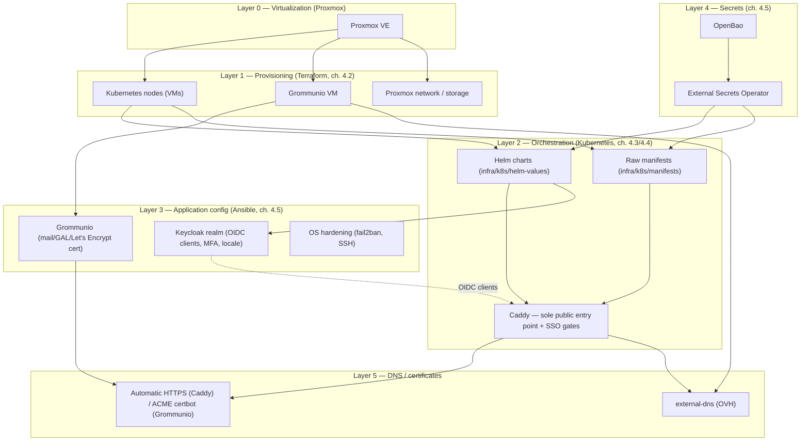
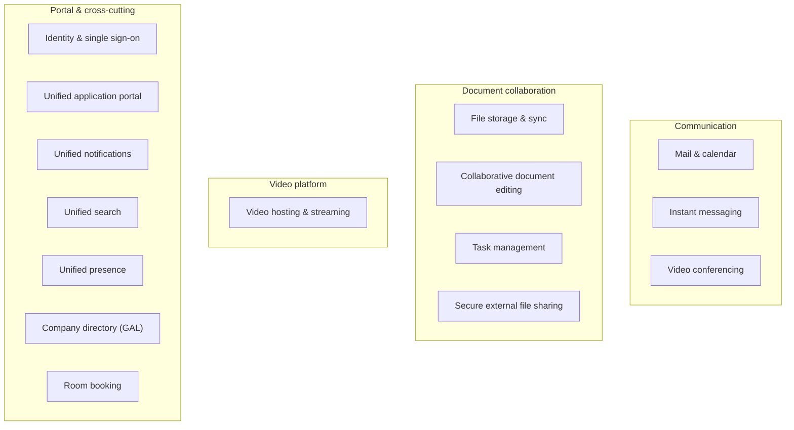
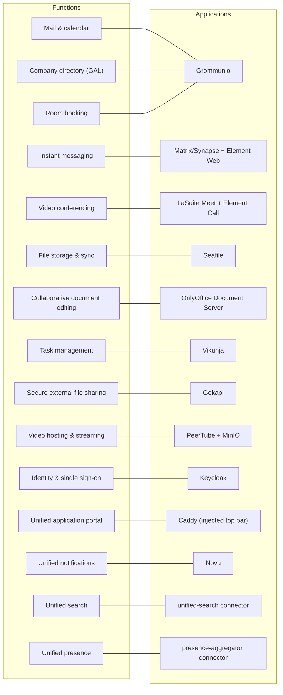
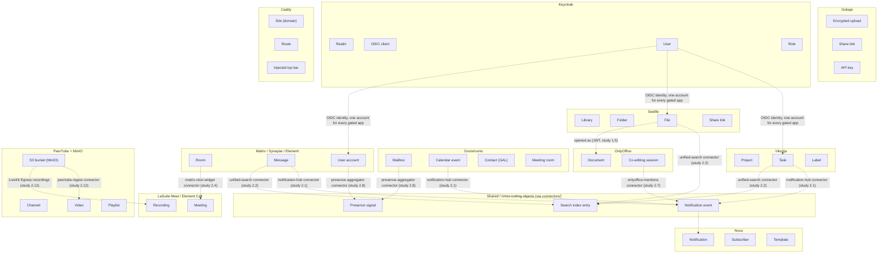

# libre365

Exit from Office 365 to a free/open-source stack — implementation of the study
[`office365-exit-study.md`](./office365-exit-study.md).

This repository materializes the architecture described in the study:
infrastructure as code, application building blocks, in-house integration
connectors, and a durable integration test suite. It is organized so that
each code directory refers explicitly to the chapter/section of the study
that motivates its existence — see [`docs/mapping.md`](./docs/mapping.md) for
the complete correspondence table.

## Architecture diagrams

### 1. Infrastructure layers



### 2. Functional cartography

The functional domains identified by the study, independent of which
application covers each one (see diagram 3 for that mapping):



### 3. Functional coverage — which application covers which function



### 4. Applications and their internal macro-objects



## Directory layout

```
infra/
  terraform/        Proxmox infrastructure IaC (VM, network) — chapter 4.2/4.5
  ansible/           Application configuration (Keycloak realms, Matrix domain, GAL...) — chapter 4.5
  k8s/
    helm-values/     Helm values per containerized building block — chapter 4.3/4.4
    manifests/       Raw manifests for building blocks without a suitable official chart
    helm-values/dev/ Dev-speed hardening overlays for the local k3d cluster
    manifests/connectors/, manifests/dev/  In-house connectors + dev-only Caddy for k3d
dev-cluster/         Local dev environment — chapter 4.6
  deploy.sh, redeploy.sh, destroy.sh  k3d cluster reusing infra/k8s/, "durcir en dev"
  grommunio-dev/     docker-compose recipe for the one brick k3d can't host
connectors/          In-house integration modules — chapter 2
tests/integration/   Durable integration test suite — chapter 5.5
.github/workflows/   CI/CD: CVE scanning, version monitoring, ephemeral staging — chapter 5
docs/                Supplementary technical documentation
```

## Guiding principle

The entire infrastructure must be rebuildable from this repository alone
(chapter 4.1): sizing parameters (replicas, resources) are driven by
variables to cover the 100 → 2000+ user growth path without rewrites, never
hard-coded.

## A single source for versions, ports, and domain names: `platform.yaml`

The development environment (`dev-cluster/`) and the production target
(`infra/k8s/`) describe the same building blocks through two different
mechanisms (Docker Hub image vs. Helm chart) for the one brick that stays
on docker-compose: without precaution, their version tags and their ports
silently drift apart from one another — this has actually already happened
once in this repository (the default ports in `tests/integration/` had
diverged from those in the dev environment). The same risk existed for
public domain names: `sso.libre365.example.org` alone used to be hardcoded
independently in 8 different files.

[`platform.yaml`](./platform.yaml) is now the only authorized source for
these values. It feeds:
- the image tag in `dev-cluster/grommunio-dev/docker-compose.yml` and the
  `FROM python:...` lines of `connectors/*/Dockerfile`;
- `image.repository`/`image.tag` in `infra/k8s/helm-values/*.yaml` (and the
  raw `image:` line of `infra/k8s/manifests/gokapi.yaml`);
- the generated ports block in `dev-cluster/grommunio-dev/.env.example` and
  `dev-cluster/k3d-config.yaml`;
- the default ports in `tests/integration/conftest.py`, via the generated
  file `tests/integration/_platform_defaults.py`;
- every public domain name (`domains:` section) across
  `infra/k8s/helm-values/*.yaml`, `infra/k8s/manifests/*.yaml`, and the
  Thunderbird extension manifest — see that section's comment for how
  changing `domains.base` (e.g. to a real bought domain before production)
  propagates everywhere on the next sync.

Workflow: edit `platform.yaml`, then:

```bash
pip install -r scripts/requirements.txt
python3 scripts/sync_platform.py          # applies the changes
python3 scripts/sync_platform.py --check  # used by CI: fails on drift
```

Never modify a tag or a port directly in a generated/patched file — it will
be overwritten (or, in CI, the drift will be detected and will block the pull
request) at the next synchronization.

## Quick start (development environment)

Most of the stack now runs on a local [k3d](https://k3d.io/) Kubernetes
cluster that reuses the production Helm charts (chapter 4.4), hardened for
dev speed — see [`dev-cluster/README.md`](./dev-cluster/README.md) for the
full rationale. Only `grommunio-dev` remains on docker-compose (no
production Kubernetes counterpart worth reusing — see that same README):

```bash
# grommunio-dev (docker-compose)
cd dev-cluster/grommunio-dev
cp .env.example .env
docker compose up -d
cd ../..

# everything else (k3d, reusing infra/k8s/)
./dev-cluster/deploy.sh
```

See [`dev-cluster/grommunio-dev/README.md`](./dev-cluster/grommunio-dev/README.md)
and [`dev-cluster/README.md`](./dev-cluster/README.md) for details on the
services started, their default credentials, and the fast
edit/rebuild/observe loop (`dev-cluster/redeploy.sh`).

## Integration tests

```bash
cd tests/integration
pip install -r requirements.txt
pytest -m smoke              # critical scenarios, against the dev environment (k3d + docker-compose)
```

See [`tests/integration/README.md`](./tests/integration/README.md).

## Status

This repository is an active work in progress: each building block/connector
carries its actual progress state (scaffold, functional, validated in
staging) in its own README rather than in a global status that would quickly
become stale. The open items identified by the study (end of the document
`office365-exit-study.md`) remain the reference for prioritizing upcoming
work.
